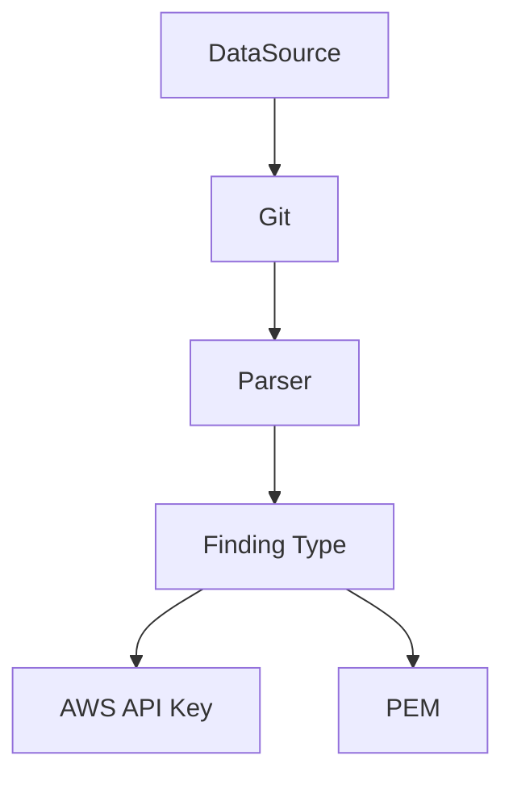

# Introduction
This project is an experiment of different pattern detection methods, serving as a review of a selection of techniques 
to detect patterns such as digital secrets (API Keys, Credentials, Tokens etc.). 

The purpose of this is to compare and contrast both the *compute performance* and *developer toil* associated with 
detectors created with each manner. 

### Parsers
| Library                                                      | Kind                                                                   | Description                                                                                                                                                 | status      |
|--------------------------------------------------------------|------------------------------------------------------------------------|-------------------------------------------------------------------------------------------------------------------------------------------------------------|-------------|
| [winnow](https://docs.rs/winnow/latest/winnow/index.html)    | [Parser combinator](https://en.wikipedia.org/wiki/Parser_combinator)   | A "batteries included" fork of [nom](https://docs.rs/nom/latest/nom/#).                                                                                     | in-progress |
| [chumsky](https://docs.rs/chumsky/latest/chumsky/index.html) | [Parser combinator](https://en.wikipedia.org/wiki/Parser_combinator)   | Expressive high-performance parser library.                                                                                                                 | todo        |
| [pest](https://docs.rs/pest/latest/pest/)                    | [PEG Parser](https://en.wikipedia.org/wiki/Parsing_expression_grammar) | General purpose parser library utilising PEG grammar.                                                                                                       | todo        |
| [vectorscan](https://docs.rs/vectorscan/latest/vectorscan/)  | [Regular Expression](https://en.wikipedia.org/wiki/Regular_expression) | open source, cross-platform fork of Intel's [hyperscan](https://docs.rs/hyperscan/latest/hyperscan/) library. A high performance Regular Expression engine. | todo        |

### Finding Types
| ID | Name            | Description                      | Standard / Spec documentation                                                                                                | validation |
|----|-----------------|----------------------------------|------------------------------------------------------------------------------------------------------------------------------|------------|
| 1  | AWS API Key     | An Amazon AWS API Key credential | [IAM Unique Identifiers](https://docs.aws.amazon.com/IAM/latest/UserGuide/reference_identifiers.html#identifiers-unique-ids) | Online     |
| 2  | PEM Private Key | A PEM formatted private key      | [RFC7468](https://www.rfc-editor.org/rfc/rfc7468)                                                                            | Offline    |

### Validation
Findings can be validated through a number of methods, both offline and online. For example, for the PEM type, we can do
offline validation by attempting to parse it as a private key or certificate. If it is a Private Key Pair, we can then 
attempt to extract the Public Key. If however it is a certificate, we can attempt to extract the certificate's 
fingerprint. Online validation can be done by attempting to authenticate with the associated service.

### Structure
The scanning engine ingests data from the *Data Source* (e.g. Git) and parses it with the *Parser*. Findings are 
produced by the parser and are created as *Finding Types*. This abstraction allows for portability of common 
functionality such as validation of the parsed data. 

